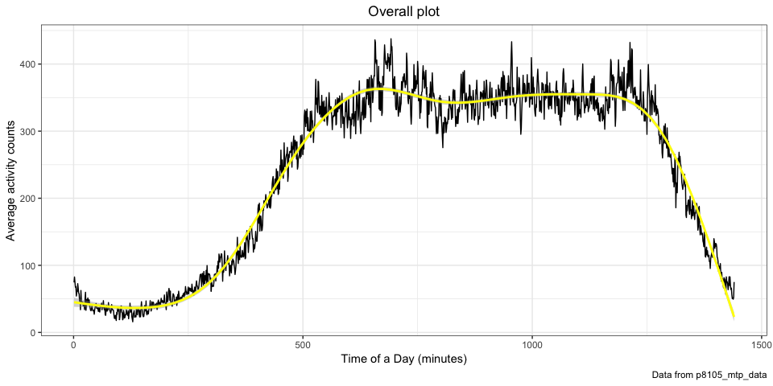
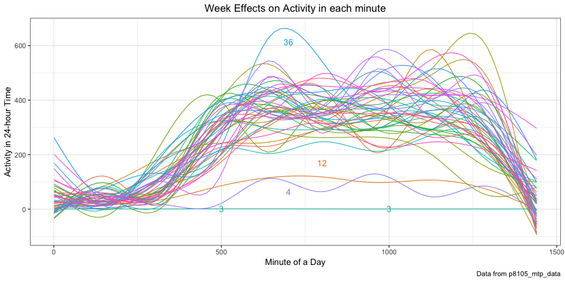

p8105\_mtp\_hx2263
================
Tiffany Xi
10/16/2018

### Load

``` r
am_data = 
  read_csv(file = "./data/p8105_mtp_data.csv")
```

### Tidy

``` r
am_data_tidy = 
  am_data %>% 
  janitor::clean_names() %>% 
  mutate(day = fct_relevel(day, str_c(c("Sunday", "Monday", "Tuesday", "Wednesday",
                                        "Thursday", "Friday", "Saturday")))) %>%
  arrange(week, day) %>% 
  mutate(date = seq(1:nrow(.))) %>% 
  select(date, everything()) %>% 
  gather(key = "activity", value = "act_counts", activity_1:activity_1440) %>% 
  separate(activity, into = c("act", "time"), sep = "_") %>% 
  select(-act) %>% 
  arrange(week, day) %>% 
  mutate(time = as.integer(time))
```

### Description

Resulting dataset contains 473760 observations and 5 variables which represents the record of 473760 minutes in 329 days of 47 weeks. Variables `week`, `day`, `act_counts` respectively represent the week number, weekdays in that week, and the activity counts in each minute of a 24-hour-day starting midnight. `time` is the minute counts in every day. `date` is the number of distinct day.

### Exploratory analyses

**Silent counts**

``` r
am_data_tidy %>% 
  filter(act_counts == 1) %>% 
  group_by(week, day) %>% 
  summarise(num_1 = sum(act_counts)) %>% 
  filter(num_1 == 1440) %>% 
  count(week) %>% 
  knitr::kable()
```

|  week|    n|
|-----:|----:|
|     1|    1|
|     2|    1|
|     3|    4|
|     4|    4|
|     8|    1|
|    12|    3|
|    13|    1|
|    19|    1|
|    20|    1|
|    32|    1|

In most days of week3, 4 and 12, the number of activity `counts == 1` of this patient are 1440, which means in these days, he was completely inactive for 24-hours, which doesn't make sense, so I assume he took off the accelerometer device. So data in those days are not informative any more.

**Distributions for outliers**

``` r
am_data_tidy_1 = am_data_tidy %>% 
  filter(act_counts > 1)

outlier = 1.5*(summary(am_data_tidy_1$act_counts)[5]-summary(am_data_tidy_1$act_counts)[2])+summary(am_data_tidy_1$act_counts)[5]

am_data_tidy_1 %>% 
  filter(act_counts > outlier) %>% 
  mutate(id = as.integer(rownames(.))) %>% 
  ggplot(aes(x = act_counts)) +
  geom_histogram(bins = 100) +
  labs(
    title = "Distributions for Outliers",
    x = "Outlier Values",
    y = "Outliers Counts",
    caption = "Data from p8105_mtp_data"
  ) 
```


Distributions for Outliers is highly-right-skewed histgram, most of outliers cluster in low values of &lt;2500 and the counts decrease as the value increases.

### Aggregate accross minutes

``` r
total_activity_over_day = am_data_tidy %>% 
  group_by(week, day, date) %>% 
  summarise(total = as.integer(sum(act_counts)))
total_activity_over_day
```

    ## # A tibble: 329 x 4
    ## # Groups:   week, day [?]
    ##     week day        date  total
    ##    <int> <fct>     <int>  <int>
    ##  1     1 Sunday        1 196937
    ##  2     1 Monday        2 432750
    ##  3     1 Tuesday       3 297427
    ##  4     1 Wednesday     4 369435
    ##  5     1 Thursday      5 366178
    ##  6     1 Friday        6 416165
    ##  7     1 Saturday      7   1440
    ##  8     2 Sunday        8   1440
    ##  9     2 Monday        9 275174
    ## 10     2 Tuesday      10 293201
    ## # ... with 319 more rows

### Whether patient became more active over time

### Visually

``` r
total_activity_over_day %>% 
  ggplot(aes(y = total, x = date)) +
  geom_line(alpha = .6) +
  geom_smooth(method = "lm", size = .6, color = "red") +
  geom_smooth(se = F, size = .5) +
  labs(
    title = "Total Activity Over the Day",
    x = "Days",
    y = "Total activity over the day",
    caption = "Data from p8105_mtp_data"
  )
```


This participant did become more active over time based on the increasing trend of the blue smoothline and red linear-regression line. His activeness increased in 47weeks, although there were many fluctuations over time. Maybe he did recover from CHF.

### Formal statistical analyses

``` r
lm(total_activity_over_day$total~total_activity_over_day$date)
```

    ## 
    ## Call:
    ## lm(formula = total_activity_over_day$total ~ total_activity_over_day$date)
    ## 
    ## Coefficients:
    ##                  (Intercept)  total_activity_over_day$date  
    ##                       251538                           573

According to linear regression, slope is 573 ( &gt; 0 ), so the total activity counts is in positive proportion to date. So, he did become more active over time based on statistical analyses, which is in line with visualization.

### Day of the week affects activity

``` r
total_activity_over_day %>% 
  group_by(day) %>% 
  ggplot(aes(x = day, y = total, fill = day)) +
  viridis::scale_fill_viridis(name = "Day of week", discrete = TRUE) +
  geom_boxplot() +
  labs(
    title = "Day of the Week Effects On Activity",
    subtitle = "in isolation to the effect of time",
    x = "Day of the Week",
    y = "Activity of the Day"
  ) + 
  theme(plot.subtitle = element_text(hjust = 0.5))
```


Day of week does affect total activity over the day. This patient were more active in Sunday and Friday (higher-median and wider-IQR), the reason maybe there are regular activities like parties or scheduled rehabilitation, and less active in Monday and Tuesday. He was tired and rest in first two weekdays.

``` r
am_data_tidy %>% 
  group_by(week, day) %>% 
  summarise(total_counts_per_day = mean(act_counts)) %>% 
  ggplot(aes(x = week, y = day)) +
  geom_tile(aes(fill = total_counts_per_day), colour = "white") +
  scale_fill_gradient(low = "lightyellow", high = "darkblue") +
  labs(
    title = "Effect of Week on Activity",
    subtitle = "in addition to the effect of time",
    x = "Weeks",
    y = "Day of the Week"
  ) + 
  theme(plot.subtitle = element_text(hjust = 0.5))
```


Day of the week does affect activity in addition to the effect of week time. In week3, 4 and 12, there were no activity. On Sunday and Friday, more dark-color cubes means higher activity level.

### Distribution of activity counts in full dataset

``` r
pastecs::stat.desc(am_data_tidy[c("act_counts")], 
                   basic = TRUE, p = 0.95) %>% 
  knitr::kable(digits = 2, align = 'l')
```

|              | act\_counts  |
|--------------|:-------------|
| nbr.val      | 473760.00    |
| nbr.null     | 0.00         |
| nbr.na       | 0.00         |
| min          | 1.00         |
| max          | 10417.00     |
| range        | 10416.00     |
| sum          | 113862053.58 |
| median       | 43.00        |
| mean         | 240.34       |
| SE.mean      | 0.60         |
| CI.mean.0.95 | 1.18         |
| var          | 172668.67    |
| std.dev      | 415.53       |
| coef.var     | 1.73         |

Mean is much larger than median, indicating the distribution of activity counts in full dataset is highly right-skewed. The high SD indicates the datapoints are spread-out over a wide range.

### Other variables of interest

``` r
am_data_tidy %>% 
  group_by(day) %>% 
  summarise(sd = sd(act_counts)) %>% 
  knitr::kable(digits = 2, align = 'l')
```

| day       | sd     |
|:----------|:-------|
| Sunday    | 510.46 |
| Monday    | 369.17 |
| Tuesday   | 352.49 |
| Wednesday | 376.11 |
| Thursday  | 387.30 |
| Friday    | 461.99 |
| Saturday  | 424.81 |

Standard deviation of Sunday and Friday data are largest, the activity fluctuation in these days are largest, the patient had more action.

### Visualization of 24-hour-activity “profiles” for each day

``` r
am_data_tidy %>% 
  group_by(time) %>% 
  summarise(mean_act_counts = mean(act_counts)) %>% 
  ggplot(aes(x = time, y = mean_act_counts)) + 
  geom_line() +
  geom_smooth(color = "yellow") +
  labs(
    title = "Overall plot",
    x = "Time of a Day (minutes)",
    y = "Average activity counts",
    caption = "Data from p8105_mtp_data"
  )
```



Mean 24-hour activity profiles change along with time of one day, activity level in evening is much lower than that in the daytime, representing his sleeping status, no physical activity. There are more dramatic fluctuations in daytime than in night.

### Visualize effect of week on activity

``` r
week_effect = am_data_tidy %>% 
  mutate(week = as.character(week)) %>% 
  group_by(week, time) %>% 
  summarise(total_week = mean(act_counts)) 

week_effect %>%
  ggplot(aes(x = time, y = total_week, color = week)) +
  geom_smooth(se = FALSE, size = .4) +
  geom_text(data = filter(week_effect, week == 36 & (time == 700)),
            aes(label = week)) +
  geom_text(data = filter(week_effect, week == 4 & time == 700),
            aes(label = week)) +
  geom_text(data = filter(week_effect, week == 12 & time == 800),
            aes(label = week)) +
  geom_text(data = filter(week_effect, week == 3 & (time == 500 | time == 1000)),
            aes(label = week)) +
  theme(legend.position = "none") + 
  labs(
    title = "Week Effects on Activity in each minute",
    x = "Minute of a Day",
    y = "Activity in 24-hour Time",
    caption = "Data from p8105_mtp_data"
  )
```


In week3, 4 and 12, there were hardly any activity, which could because the sudden deteriorating condition of his disease. But the data in week3 is weird, it could because the patient was not wearing the device in week3. In week36, highest activity level happens in noon, maybe he was working out.

### Day of the week effects on activity

``` r
sepe = am_data_tidy %>% 
  group_by(day, time) %>% 
  summarise(sum_act_counts = mean(act_counts)) %>% 
  ggplot(aes(x = time, y = sum_act_counts, color = day)) +
  facet_grid( ~ day) +
  geom_line(alpha = .5) +
  geom_smooth(size = .7) +
  theme(legend.position = "none") + 
  labs(
    title = "Day of the Week Effects on Activity in Each Minute",
    x = "Minute of a Day",
    y = "Activity Counts"
  )
  
all = am_data_tidy %>% 
  group_by(day, time) %>% 
  summarise(sum_act_counts = mean(act_counts)) %>% 
  ggplot(aes(x = time, y = sum_act_counts, color = day)) +
  geom_line(alpha = .5) +
  geom_smooth(size = .7, se = FALSE) + 
  labs(
    x = "Minute of a Day",
    y = "Activity Counts",
    caption = "Data from p8105_mtp_data"
  )

sepe / all + plot_layout(ncol = 1, heights = c(1, 3))
```



Activity profiles for every day of week are mostly identical, so he had a relatively regular lifestyle.

But he were more active in Sunday noon and Thursday, Friday late-night, it makes sense because of weekends effect. Thursday is the new Friday! Whereas, in Monday Tuesday, the activity profile are much flattened indicating the dailylife in first two weekdays are plain, so he were less physically active.
