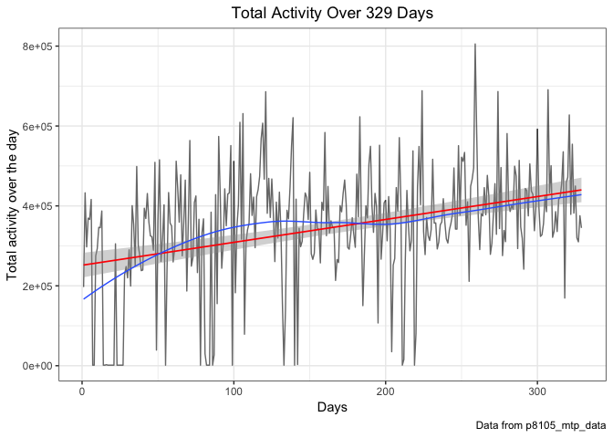
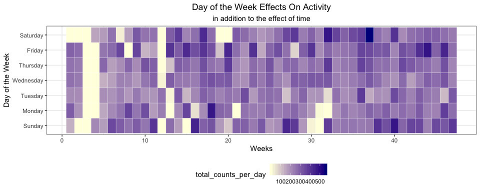
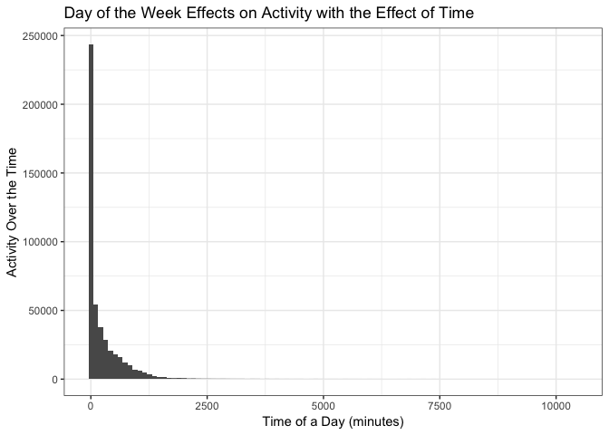
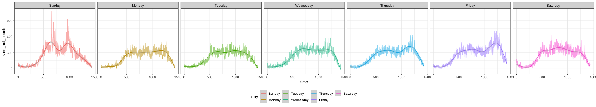

p8105\_mtp\_hx2263
================
Tiffany Xi
10/16/2018

Load, tidy & EDA
================

### Load dataset

Import the data file with `read_csv` using relative path.

``` r
am_data = 
  read_csv(file = "./data/p8105_mtp_data.csv")
```

### Tidy data

``` r
am_data_tidy = 
  am_data %>% 
  janitor::clean_names() %>% 
  mutate(day = fct_relevel(day, str_c(c("Sunday", "Monday", "Tuesday", "Wednesday",
                                        "Thursday", "Friday", "Saturday")))) %>%
  arrange(week, day) %>% 
  mutate(date = seq(1:nrow(.))) %>% 
  select(date, everything()) %>% 
  gather(key = "activity", value = "act_counts", activity_1:activity_1440) %>% 
  separate(activity, into = c("act", "time"), sep = "_") %>% 
  select(-act) %>% 
  arrange(week, day) %>% 
  mutate(time = as.integer(time)) %>% 
  group_by(date) %>% 
  mutate(hour = rep(1:24, each = 60)) %>% 
  ungroup(date)
```

### Describe the resulting dataset

Resulting dataset contains 473760 observations and 6 variables which represents the record of 473760 minutes in 329 days of 47 weeks. Variables `week`, `day`, `act_counts` respectively stand for the week number, weekdays in that week, and the activity counts for each minute of a 24-hour day starting at midnight. In tidy dataset, `time` is the minute count in one specific day and `act_counts` is the same as `activity.*` in original dataset. Variables `date` is the number of every distinct day. And `hour` variable stands for every hour in one day.

### Discuss any additional exploratory analyses

**Silent counts**

``` r
am_data_tidy %>% 
  filter(act_counts == 1) %>% 
  group_by(week, day) %>% 
  summarise(num_1 = sum(act_counts)) %>% 
  filter(num_1 == 1440) %>% 
  count(week) %>% 
  knitr::kable()
```

|  week|    n|
|-----:|----:|
|     1|    1|
|     2|    1|
|     3|    4|
|     4|    4|
|     8|    1|
|    12|    3|
|    13|    1|
|    19|    1|
|    20|    1|
|    32|    1|

From the table above, in most days of week 3, 4 and 12, the number of activity `counts == 1` of this patient are 1440, which means in these days, he was completely inactive for 24 hours, which doesn't make any sense, so I assume that he took off the accelerometer device. So the activity data in those days are not informative any more.

**Changes of activity counts on a weekly basis**

``` r
am_data_tidy %>% 
  group_by(week) %>% 
  summarise(total_week = sum(act_counts)) %>% 
  ggplot(aes(x = week, y = total_week)) +
  geom_line() +
  geom_smooth() +
  labs(
    title = "Weekly plot",
    x = "Week",
    y = "Total activity counts in that week",
    caption = "Data from p8105_mtp_data"
  ) +
  scale_x_continuous(breaks = c(0, 3, 5, 10, 12, 15, 20, 25, 30, 35, 40, 45, 47)) +
  theme(plot.title = element_text(hjust = 0.5))
```


The total activeness of the week of this patient increased in the last 47 weeks, although there were many fluctuations over time, the overall trend is upwards. Maybe he did recover from congestive heart failure. There are a huge drop in 3rd week and 12nd week, which could due to the sudden deteriorating condition of his disease or depression mentally to cause the inactivity. But the data in week 3 is odd it could because the patient was not wearing the device some time in week 3.

**Visually inspect distributions for outliers**


From the histgram, it is obvious that most of outliers cluster in low values of less than 2500 and the counts decrease as the value increases.This patient didn't have much exaggerating activity counts.

Traditional analysis
====================

### Aggregate accross minutes to create a total activity variable.

``` r
total_activity_over_day = am_data_tidy %>% 
  group_by(week, day, date) %>% 
  summarise(total = as.integer(sum(act_counts)))
total_activity_over_day
```

    ## # A tibble: 329 x 4
    ## # Groups:   week, day [?]
    ##     week day        date  total
    ##    <int> <fct>     <int>  <int>
    ##  1     1 Sunday        1 196937
    ##  2     1 Monday        2 432750
    ##  3     1 Tuesday       3 297427
    ##  4     1 Wednesday     4 369435
    ##  5     1 Thursday      5 366178
    ##  6     1 Friday        6 416165
    ##  7     1 Saturday      7   1440
    ##  8     2 Sunday        8   1440
    ##  9     2 Monday        9 275174
    ## 10     2 Tuesday      10 293201
    ## # ... with 319 more rows

### Explore the hypothesis that this participant became more active over time

### Visually

``` r
total_activity_over_day %>% 
  ggplot(aes(y = total, x = date)) +
  geom_line() +
  geom_smooth()+ 
  labs(
    title = "Total Activity Over the Day",
    x = "Days",
    y = "Total activity over the day",
    caption = "Data from p8105_mtp_data"
  ) +
  theme(plot.title = element_text(hjust = 0.5))
```



This participant did become more active over time based on the increasing trend of the smooth line.

### Formal statistical analyses---linear regression

``` r
total_activity_over_day %>% 
  ggplot(aes(y = total, x = date)) +
  geom_point(alpha = .5) +
  geom_smooth(method = "lm")
```


``` r
lm(total_activity_over_day$total~total_activity_over_day$date)
```

    ## 
    ## Call:
    ## lm(formula = total_activity_over_day$total ~ total_activity_over_day$date)
    ## 
    ## Coefficients:
    ##                  (Intercept)  total_activity_over_day$date  
    ##                       251538                           573

According to the results of linear regression, slope is 573 which is greater than 0, so we conclude that the total activity counts is in positive proportion to date. So, this participant did become more active over time based on formal statistical analyses, which is in line with visual result.

### Examine the possibility that day of the week affects activity (in isolation to the effect of time)

``` r
total_activity_over_day %>% 
  group_by(day) %>% 
  ggplot(aes(x = day, y = total, fill = day)) +
  viridis::scale_fill_viridis(name = "Day of week", discrete = TRUE) +
  geom_boxplot() +
  labs(
    title = "Day of the Week Effects On Activity",
    x = "Day of the Week",
    y = "Activity of the Day"
  ) +
  theme(plot.title = element_text(hjust = 0.5))
```


Day of the week does affect total activity over the day. This patient are tend to be more active in Sunday and Friday, and less active in Monday and Tuesday. The reason may be there are some regular activities like party or scheduled rehabilitation in Sunday and Friday, he will be tired in Monday and get some rest so stay in room in first two weekdays.

### Examine the possibility that day of the week affects activity (in addition to the effect of time)

``` r
am_data_tidy %>% 
  group_by(day, time) %>%
  summarise(dow_act_counts = mean(act_counts)) %>% 
  ggplot(aes(x = time, y = dow_act_counts, color = day)) +
  geom_smooth(se = FALSE, size = .5) +
  labs(
    title = "Day of the Week Effects on Activity with the Effect of Time",
    x = "Time of a Day (minutes)",
    y = "Activity Over the Time"
  ) +
  theme(plot.title = element_text(hjust = 0.5))
```



Day of the week does affect activity in addition to the effect of time. Curve of thursday, friday, and sunday have significantly larger fluctuations in nights than other days of the week. Other days are relatively gentle and flat.

Inspect activity over the course of the day
===========================================

### Explore the distribution of activity counts in the full dataset, taking into account other variables of interest.

``` r
am_data_tidy %>% 
  group_by(day, hour) %>% 
  summarise(total_day = mean(act_counts)) %>% 
  ggplot(aes(x = hour, y = day)) +
  geom_tile(aes(fill = total_day), colour = "white") +
  scale_fill_gradient(low = "lightyellow", high = "darkblue")
```



*Day VS Activity Counts*

``` r
am_data_tidy %>% 
  group_by(day, time) %>% 
  summarise(total_day = mean(act_counts)) %>% 
  ggplot(aes(x = time, y = total_day, color = day)) +
  geom_line(alpha = .4) +
  geom_smooth(size = .5, se = F) + 
  labs(
    title = "Distribution of Activity Counts in the Full Dataset",
    x = "Minutes of All Days",
    y = "Activity Counts",
    caption = "Data from p8105_mtp_data"
  ) +
  theme(plot.title = element_text(hjust = 0.5))
```


*Week VS Counts*

``` r
week_effect = am_data_tidy %>% 
  mutate(week = as.character(week)) %>% 
  group_by(week, time) %>% 
  summarise(total_week = mean(act_counts)) 

week_effect %>%
  ggplot(aes(x = time, y = total_week, color = week)) +
  geom_smooth(se = FALSE, size = .5) +
  geom_text(data = filter(week_effect, week == 36 & (time == 700)),
            aes(label = week)) +
  geom_text(data = filter(week_effect, week == 4 & time == 700),
            aes(label = week)) +
  geom_text(data = filter(week_effect, week == 12 & time == 800),
            aes(label = week)) +
  geom_text(data = filter(week_effect, week == 3 & (time == 500 | time == 1000)),
            aes(label = week)) +
  theme(legend.position = "none") + 
  labs(
    title = "Week Effects on Activity in 24-hour Time",
    x = "Minute of a Day",
    y = "Activity in 24-hour Time",
    caption = "Data from p8105_mtp_data"
  ) +
  theme(plot.title = element_text(hjust = 0.5))
```


In week 3, 4 and 12, there were not much activity. In week 36, highest activity level happens in noon, maybe he was working out or emotionally high.

### Make a visualization to show the 24-hour activity “profiles” for each day

``` r
am_data_tidy %>% 
  mutate(date = paste(as.character(week), day)) %>% 
  filter(day == "Wednesday" & week %in% c(10, 20, 30, 45)) %>% 
  group_by(week, day) %>% 
  ggplot(aes(x = time, y = act_counts, color = date)) +
  geom_line(alpha = .5) +
  viridis::scale_fill_viridis(discrete = TRUE) +
  facet_grid(~ date) +
  theme(legend.position = "bottom")
```


``` r
am_data_tidy %>% 
  group_by(time) %>% 
  summarise(mean_act_counts = mean(act_counts)) %>% 
  ggplot(aes(x = time, y = mean_act_counts)) + 
  geom_line() +
  labs(
    title = "Overall plot",
    x = "Time of a Day (minutes)",
    y = "Average activity counts",
    caption = "Data from p8105_mtp_data"
  ) +
  theme(plot.title = element_text(hjust = 0.5))
```


I randomly select four wednesday in week 10, 20, 30, 45 and the counts distribution plot of these days are roughly similar to some extent.

In the 2nd plot, mean activity profiles change along with time of one day, in the evening, the activity level is much lower than that in the daytime, it means when you are sleeping, all body structure go to sleep. And there are more dramatic fluctuation in daytime than in night.

### Visualize effect of week on activity in each minute of the 24-hour day

``` r
am_data_tidy %>% 
  group_by(week, time) %>% 
  summarise(sum_act_counts = sum(act_counts)) %>% 
  ggplot(aes(x = time, y = sum_act_counts, color = week)) +
  geom_line(alpha = 0.3) +
  geom_smooth()
```


### day of the week effects on activity in each minute of the 24-hour day; incorporating smooth estimates of mean activity profiles to clarify these effects.

``` r
am_data_tidy %>% 
  group_by(day, time) %>% 
  summarise(sum_act_counts = mean(act_counts)) %>% 
  ggplot(aes(x = time, y = sum_act_counts, color = day)) +
  facet_grid(~day, space = "free") +
  geom_line(alpha = .5) +
  geom_smooth(size = .5) +
  theme_bw() +
  theme(legend.position = "bottom")
```



*Comment*: The 24-hour activity profiles for every day of the week are mostly identical to each other. so the patient had a relatively regular lifestyle.

It is quite obvious that this patient tend to be more active in Sunday noon and night and Thursday, Friday late-night, it makes sense because of the weekends effect. Thursday is the new Friday! Whereas, in Monday, Tuesday and Wednesday, the activity profile are relatively much flattened which indicates that the daily life in first three weekdays are plain and boring, so the patient were less active than weekends, both physically and mentally.
