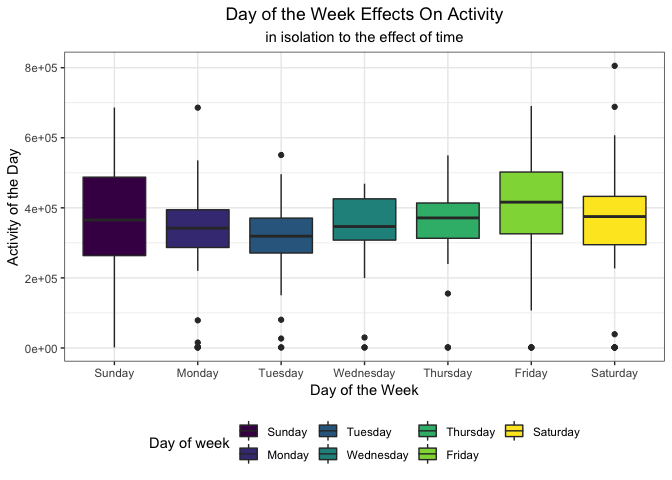

p8105\_mtp\_hx2263
================
Tiffany Xi
10/16/2018

### Load dataset

Import the data file with `read_csv` using relative path.

``` r
am_data = 
  read_csv(file = "./data/p8105_mtp_data.csv")
```

### Tidy data

Use `fct_relevel` to reorder the weekdays to normal order and change `day` into factors; Then `gather` takes all `activity.*` columns and collapses into key-value pairs, duplicating all other columns as needed.

``` r
am_data_tidy = 
  am_data %>% 
  janitor::clean_names() %>% 
  mutate(day = fct_relevel(day, str_c(c("Sunday", "Monday", "Tuesday", "Wednesday",
                                        "Thursday", "Friday", "Saturday"))))%>%
  gather(key = "activity", value = "act_counts", activity_1:activity_1440) %>% 
  separate(activity, into = c("act", "time"), sep = "_") %>% 
  select(-act) %>% 
  arrange(week, day) %>% 
  mutate(time = as.integer(time),
         act_counts = as.numeric(act_counts))

skimr::skim(am_data_tidy)
```

    ## Skim summary statistics
    ##  n obs: 473760 
    ##  n variables: 4 
    ## 
    ## ── Variable type:factor ────────────────────────────────────────────────────────────────────────────────────────
    ##  variable missing complete      n n_unique
    ##       day       0   473760 473760        7
    ##                                      top_counts ordered
    ##  Sun: 67680, Mon: 67680, Tue: 67680, Wed: 67680   FALSE
    ## 
    ## ── Variable type:integer ───────────────────────────────────────────────────────────────────────────────────────
    ##  variable missing complete      n  mean     sd p0    p25   p50     p75
    ##      time       0   473760 473760 720.5 415.69  1 360.75 720.5 1080.25
    ##      week       0   473760 473760  24    13.56  1  12     24     36   
    ##  p100     hist
    ##  1440 ▇▇▇▇▇▇▇▇
    ##    47 ▇▇▇▇▇▇▇▇
    ## 
    ## ── Variable type:numeric ───────────────────────────────────────────────────────────────────────────────────────
    ##    variable missing complete      n   mean     sd p0 p25 p50 p75  p100
    ##  act_counts       0   473760 473760 240.34 415.53  1   1  43 335 10417
    ##      hist
    ##  ▇▁▁▁▁▁▁▁

### Describe the resulting dataset

This original dataset has 1442 columns and 329 rows, which means there are 329 observations and 1442 variables in raw data. Resulting dataset contains 473760 observations and 4 variables which represents the record of 473760 minutes in 329 days of 47 weeks. Variables `week`, `day`, `activity.*` respectively stand for the week number, weekdays in that week, and the activity counts for each minute of a 24-hour day starting at midnight. In tidy dataset, `time` is the minute count in one specific day and `act_counts` is the same as `activity.*`.

### Discuss any additional exploratory analyses

**Change of activity on the 24-hour basis in average of all days**

``` r
am_data_tidy %>% 
  group_by(time) %>% 
  summarise(mean_act_counts = mean(act_counts)) %>% 
  ggplot(aes(x = time, y = mean_act_counts)) + 
  geom_line() +
  theme_bw()
```


Mean activity profiles change along with time of one day, in the evening, the activity level is much lower than that in the daytime, it means when you are sleeping, all body structure go to sleep. And there are more dramatic fluctuation in daytime than in night.

**Slient counts**

``` r
am_data_tidy %>% 
  filter(act_counts == 1) %>% 
  group_by(week, day) %>% 
  summarise(n = sum(act_counts)) %>% 
  filter(n == 1440)
```

    ## # A tibble: 18 x 3
    ## # Groups:   week [10]
    ##     week day           n
    ##    <int> <fct>     <dbl>
    ##  1     1 Saturday   1440
    ##  2     2 Sunday     1440
    ##  3     3 Sunday     1440
    ##  4     3 Wednesday  1440
    ##  5     3 Thursday   1440
    ##  6     3 Friday     1440
    ##  7     4 Monday     1440
    ##  8     4 Wednesday  1440
    ##  9     4 Thursday   1440
    ## 10     4 Friday     1440
    ## 11     8 Friday     1440
    ## 12    12 Sunday     1440
    ## 13    12 Friday     1440
    ## 14    12 Saturday   1440
    ## 15    13 Monday     1440
    ## 16    19 Saturday   1440
    ## 17    20 Saturday   1440
    ## 18    32 Monday     1440

From the table above, we can see that in the Saturday of first week, 3rd and 4th week and so on, the number of activity `counts == 1` of this patient are 1440, which means in these days, he was completely in active for 24 hours, which doesn't make any sense, so I assume that he took off the accelerometer device. So the activity data in those days are not informative any more.

**Changes of activity counts on a weekly basis**

``` r
am_data_tidy %>% 
  group_by(week) %>% 
  summarise(total_week = sum(act_counts)) %>% 
  ggplot(aes(x = week, y = total_week)) +
  geom_line() +
  geom_smooth() +
  theme_bw()+ 
  labs(
    title = "Weekly plot",
    x = "Week",
    y = "Total activity counts in that week",
    caption = "Data from p8105_mtp_data"
  ) +
  scale_x_continuous(breaks = c(0, 3, 5, 10, 12, 15, 20, 25, 30, 35, 40, 45, 47))
```

    ## `geom_smooth()` using method = 'loess' and formula 'y ~ x'


The total activeness of the week of this patient increased in the last 47 weeks, although there were many moderate fluctuations over time period, the overall trend is upwards. Maybe he did recover from congestive heart failure. There are a huge drop in 3rd week and 12nd week, which could due to the sudden deteriorating condition of his disease or depression mentally to cause the inactivity. But the data in third week is a little odd it could because the patient took off the device some time in week 3.

**Visually inspect distributions for outliers, but include only if these are informative**

I manully calculate the outlier criteria---75% percentile + 1.5 times IQR, and then `filter` out all the outliers, using `histgram` to show the distribution of those outliers. From the histgram, it is obvious that most of outliers cluster in low values of less than 2500 and the counts decrease as the value increases.This patient didn't have much exaggerating activity counts.

``` r
am_data_tidy_1 = am_data_tidy %>% 
  filter(act_counts > 1)

1.5*(summary(am_data_tidy_1$act_counts)[5]-summary(am_data_tidy_1$act_counts)[2])+summary(am_data_tidy_1$act_counts)[5]
```

    ## 3rd Qu. 
    ##    1355

``` r
am_data_tidy_1 %>% 
  filter(act_counts > 1355) %>% 
  mutate(id = as.integer(rownames(.))) %>% 
  ggplot(aes(x = act_counts)) +
  geom_histogram()
```

    ## `stat_bin()` using `bins = 30`. Pick better value with `binwidth`.


``` r
am_data_tidy %>% 
  group_by(week, day) %>% 
  ggplot(aes(x = time, y = act_counts, color = week)) +
  facet_grid( ~ day) +
  geom_line(alpha = .4)
```


``` r
am_data_tidy %>% 
  mutate(id = as.integer(rownames(am_data_tidy))) %>% 
  ggplot(aes(x = id, y = act_counts))+
  geom_line()
```



### Using your tidied dataset, aggregate accross minutes to create a total activity variable.

``` r
total_activity_over_day = am_data_tidy %>% 
  group_by(week, day) %>% 
  summarise(total = as.integer(sum(act_counts)))
total_activity_over_day
```

    ## # A tibble: 329 x 3
    ## # Groups:   week [?]
    ##     week day        total
    ##    <int> <fct>      <int>
    ##  1     1 Sunday    196937
    ##  2     1 Monday    432750
    ##  3     1 Tuesday   297427
    ##  4     1 Wednesday 369435
    ##  5     1 Thursday  366178
    ##  6     1 Friday    416165
    ##  7     1 Saturday    1440
    ##  8     2 Sunday      1440
    ##  9     2 Monday    275174
    ## 10     2 Tuesday   293201
    ## # ... with 319 more rows

### Using these data, explore the hypothesis that this participant became more active over time. You may want to want to make comparisons visually and quantitatively.

### Visually

``` r
total_activity_over_day %>% 
  ggplot(aes(y = total, x = seq(1, length(.$total)))) +
  geom_line() +
  geom_smooth()+ 
  labs(
    title = "Total Activity Over the Day",
    x = "Days",
    y = "Total activity over the day",
    caption = "Data from p8105_mtp_data"
  )
```

    ## `geom_smooth()` using method = 'loess' and formula 'y ~ x'


This participant did become more active over time based on the increasing trend of the smooth line.

### Formal statistical analyses

``` r
t.test((total_activity_over_day %>% filter(week == 1 | week == 2))$total, (total_activity_over_day %>% filter(week == 46 | week == 47))$total, paired=T)
```

    ## 
    ##  Paired t-test
    ## 
    ## data:  (total_activity_over_day %>% filter(week == 1 | week == 2))$total and (total_activity_over_day %>% filter(week == 46 | week == 47))$total
    ## t = -3.0364, df = 13, p-value = 0.009547
    ## alternative hypothesis: true difference in means is not equal to 0
    ## 95 percent confidence interval:
    ##  -257277.62  -43367.95
    ## sample estimates:
    ## mean of the differences 
    ##               -150322.8

According to the results of two-samples paired test, p-value is 0.0095 smaller than significance level 0.05, so we reject the null hypothesis and conclude that there is significant difference between first two week and last two week's activity data. So, this participant didn become more active over time based on formal statistical analyses, which in line with visual result.

### Examine the possibility that day of the week affects activity (in isolation to the effect of time)

``` r
am_data_tidy %>% 
  group_by(day) %>% 
  summarise(dow_total = sum(act_counts)) %>% 
  ggplot(aes(x = day, y = dow_total, fill = day)) +
  viridis::scale_fill_viridis(name = "Day of week", discrete = TRUE) +
  geom_bar(stat = "identity") +
  theme_bw()
```


### Examine the possibility that day of the week affects activity (in addition to the effect of time)

``` r
am_data_tidy %>% 
  group_by(day, time) %>%
  summarise(dow_act_counts = mean(act_counts)) %>% 
  ggplot(aes(x = time, y = dow_act_counts, color = day)) +
  geom_smooth(se = FALSE, size = .5) +
  theme_bw()
```

    ## `geom_smooth()` using method = 'gam' and formula 'y ~ s(x, bs = "cs")'


*Comment*: Day of the week does affect activity in addition to the effect of time

### Explore the distribution of activity counts in the full dataset, taking into account other variables of interest.

``` r
am_data_tidy %>% 
  mutate(id = as.integer(rownames(.))) %>% 
  ggplot(aes(x = id, y = act_counts)) +
  geom_line() +
  geom_smooth()
```

    ## `geom_smooth()` using method = 'gam' and formula 'y ~ s(x, bs = "cs")'


### Make a visualization to show the 24-hour activity “profiles” for each day

``` r
am_data_tidy %>% 
  mutate(date = paste(as.character(week), day)) %>% 
  #filter(date == "1 Sunday") %>% 
  group_by(week, day) %>% 
  ggplot(aes(x = time, y = act_counts, color = date)) +
  geom_line(alpha = .2) +
  theme_bw() +
  theme(legend.position = "none")
```


### Visualize effect of week on activity in each minute of the 24-hour day

``` r
am_data_tidy %>% 
  group_by(week, time) %>% 
  summarise(sum_act_counts = sum(act_counts)) %>% 
  ggplot(aes(x = time, y = sum_act_counts, color = week)) +
  geom_line(alpha = 0.3) +
  theme_bw() 
```


### day of the week effects on activity in each minute of the 24-hour day; incorporating smooth estimates of mean activity profiles may clarify these effects. Comment on relationships you think are interesting.

``` r
am_data_tidy %>% 
  group_by(day, time) %>% 
  summarise(sum_act_counts = mean(act_counts)) %>% 
  ggplot(aes(x = time, y = sum_act_counts, color = day)) +
  facet_grid(~day, space = "free") +
  geom_line(alpha = .5) +
  geom_smooth(size = .5) +
  theme_bw()
```

    ## `geom_smooth()` using method = 'gam' and formula 'y ~ s(x, bs = "cs")'


``` r
am_data_tidy %>% 
  group_by(day, time) %>% 
  summarise(sum_act_counts = sum(act_counts)) %>% 
  ggplot(aes(x = time, y = sum_act_counts)) +
  geom_line(alpha = .5, aes(color = day)) +
  geom_smooth(size = .5) +
  theme_bw()
```

    ## `geom_smooth()` using method = 'gam' and formula 'y ~ s(x, bs = "cs")'


*Comment*: The 24-hour activity profiles for every day of the week are mostly identical to each other. so the patient had a relatively regular lifestyle.

It is quite obvious that this patient tend to be more active in Sunday noon and night and Thursday, Friday late-night, it makes sense because of the weekends effect. Thursday is the new Friday! Whereas, in Monday, Tuesday and Wednesday, the activity profile are relatively much flattened which indicates that the daily life in first three weekdays are plain and boring, so the patient were less active than weekends, both physically and mentally.
